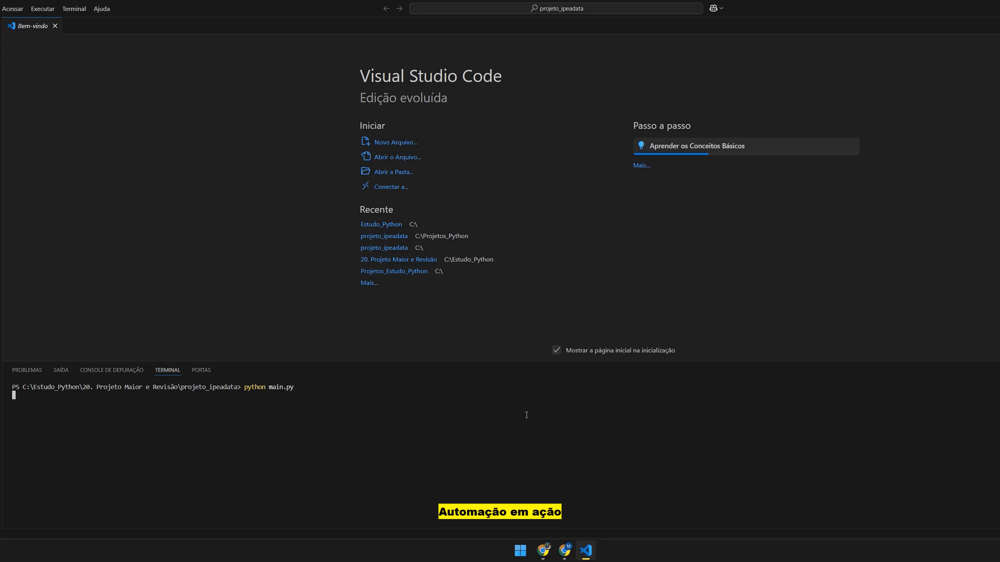

# 📊 Bot de Relatórios IpeaData

Comunica com a API do site IpeaData, gera gráfico com matplotlib e envia PDF por e-mail.

## 🎬 Demonstração


## ⚙️ Recursos
- Requisição de dados via API
- Geração de gráfico com matplotlib
- Conversão para PDF
- Envio automático por e-mail

## 🛠️ Tecnologias
- Python
- Bibliotecas: `requests`, `matplotlib`, `pdfkit`, `smtplib`

## ▶️ Como executar

```bash
python ipeadata_bot.py
